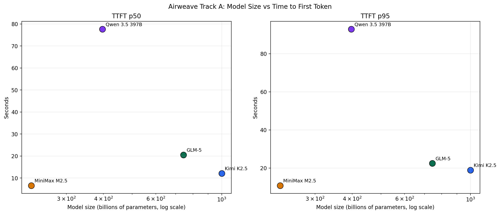
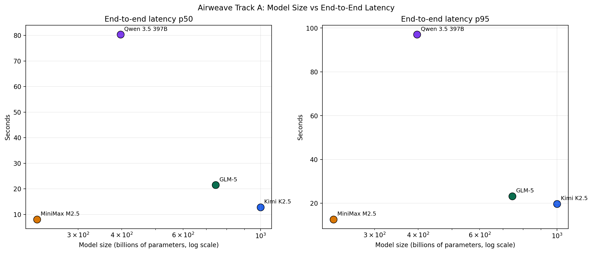
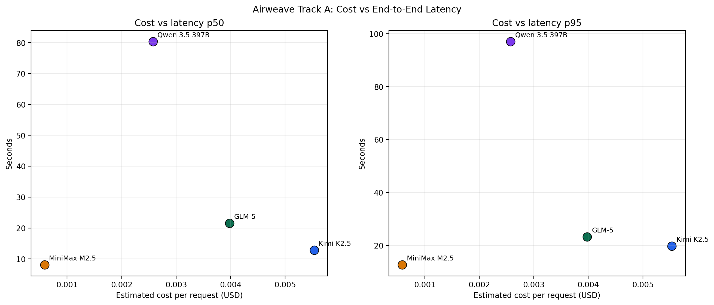
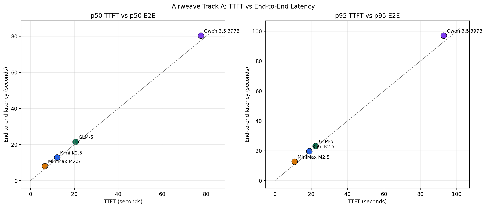

# Airweave Track A Model Report

March 13, 2026

## Summary Table

Benchmark scope:

- Workload: `Track A retrieval`
- Samples per model: `5`
- Concurrency: `1`
- Source suite: `march_2026_agentic_model_sweep_for_airweave`
- Pricing note: Kimi cost is shown using Together public serverless pricing for comparison, even though the benchmark run used a dedicated endpoint.

| model | params | ttft_p50_s | ttft_p95_s | lat_p50_s | lat_p95_s | serverless input / 1M | serverless output / 1M |
|---|---:|---:|---:|---:|---:|---:|---:|
| `zai-org/GLM-5` | 744B | 20.6 | 22.4 | 21.5 | 23.2 | $1.00 | $3.20 |
| `Qwen/Qwen3.5-397B-A17B` | 397B | 77.6 | 92.9 | 80.4 | 97.1 | $0.70 | $0.70 |
| `MiniMaxAI/MiniMax-M2.5` | 228.7B | 6.6 | 10.8 | 8.1 | 12.6 | $0.30 | $1.20 |
| `moonshotai/Kimi-K2.5` | 1T | 12.1 | 18.9 | 12.8 | 19.7 | $0.50 | $2.80 |

## Executive Takeaways

- `MiniMax M2.5` is the strongest cost-latency option in this benchmark. It was the fastest overall on end-to-end latency among the fully reliable models and also the cheapest by estimated per-request token cost.
- `Kimi K2.5` is a strong second option. It is materially faster than `GLM-5` and dramatically faster than `Qwen 3.5 397B`, with full success across the 5-sample run.
- `GLM-5` is reliable but relatively slow and somewhat expensive for the latency it delivers.
- `Qwen 3.5 397B` showed the weakest operational profile here: the slowest TTFT and end-to-end latency by a wide margin, plus one failure in the 5-sample run.

## Benchmark Setup

- Dataset: [`corpus/v1_short_retrieval_qa.jsonl`](../corpus/v1_short_retrieval_qa.jsonl)
- Suite config: [`march_2026_agentic_model_sweep_for_airweave.yaml`](../configs/suites/march_2026_agentic_model_sweep_for_airweave.yaml)
- Summary snapshot: [`airweave_track_a_latest_summary.csv`](../figures/airweave_track_a_suite/airweave_track_a_latest_summary.csv)

Latest 5-sample benchmark rows used in this report:

- `GLM-5`: success rate `100%`, estimated cost/request `$0.00398`
- `Qwen 3.5 397B`: success rate `80%`, estimated cost/request `$0.00258`
- `MiniMax M2.5`: success rate `100%`, estimated cost/request `$0.00059`
- `Kimi K2.5`: success rate `100%`, estimated cost/request `$0.00553`

## Plot 1: Model Size vs TTFT

What this shows:

- Larger parameter count does not imply better responsiveness in this set.
- `Qwen 3.5 397B` sits in a notably poor region: smaller than `GLM-5` and `Kimi`, but much slower on TTFT.
- `MiniMax M2.5` is the standout on first-token responsiveness despite being the smallest model in the group.

## Plot 2: Model Size vs End-to-End Latency

What this shows:

- `MiniMax M2.5` remains the fastest overall.
- `Kimi K2.5` is the second-fastest despite being the largest model by total parameters.
- `GLM-5` and especially `Qwen 3.5 397B` pay a heavy latency tax on this workload.

## Plot 3: Cost vs Latency

What this shows:

- `MiniMax M2.5` is the clearest efficiency frontier winner in this benchmark: lowest estimated request cost and lowest latency.
- `Kimi K2.5` improves latency materially over `GLM-5`, but at a higher estimated token cost.
- `Qwen 3.5 397B` is relatively inexpensive on token pricing alone, but its latency and failure profile make it a weak practical choice for interactive use.

## Supplement: TTFT vs End-to-End Latency

Why it matters:

- This helps distinguish “slow to start” from “slow overall.”
- `Qwen 3.5 397B` is poor on both dimensions.
- `MiniMax M2.5` and `Kimi K2.5` are much more viable for user-facing systems where perceived responsiveness matters.

## Recommendation

If the client is optimizing for practical production tradeoffs on this Track A retrieval workload:

1. Start with `MiniMaxAI/MiniMax-M2.5` as the default recommendation.
2. Consider `moonshotai/Kimi-K2.5` when the client wants a stronger premium option and can tolerate higher token cost.
3. Treat `zai-org/GLM-5` as a reliable but slower alternative.
4. Do not recommend `Qwen/Qwen3.5-397B-A17B` for latency-sensitive interactive use based on this benchmark alone.

## Pricing / Metadata Sources

Verified on March 13, 2026:

- [GLM-5 model page](https://www.together.ai/models/glm-5)
- [Kimi K2.5 model page](https://www.together.ai/models/kimi-k2-5)
- [MiniMax M2.5 model page](https://www.together.ai/models/minimax-m2-5)
- [Together serverless models docs](https://docs.together.ai/docs/serverless-models)
