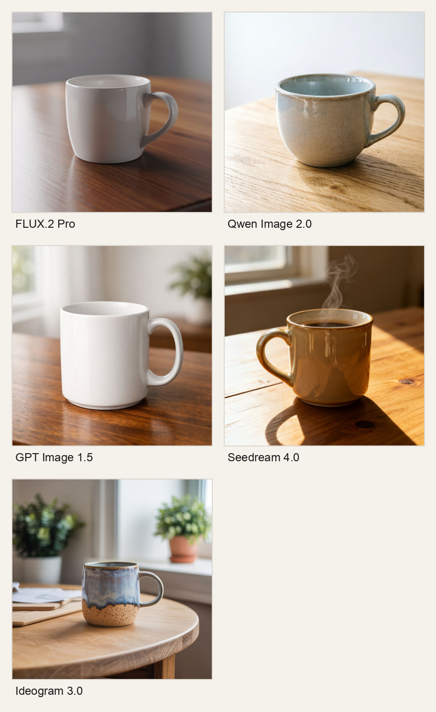

# Together Serverless Image Generation Latency Benchmark

Date: March 18, 2026

## Scope

This report summarizes a rough latency benchmark for five image-generation models served via Together serverless endpoints. The goal was to estimate how long it takes to generate one image per model under matched input conditions.

## Methodology

- Benchmark runner: project `BenchmarkSuite`-style image suite added to `benchmarker.py`.
- Endpoint/provider: Together serverless image generation API.
- Workflow tested: text-to-image only.
- Shared prompt:
  - `A premium product photo of a ceramic coffee mug on a wooden table, soft natural window light, clean background, high detail.`
- Shared settings:
  - Resolution: `1024x1024`
  - Number of images: `n=1`
  - Response format: `url`
  - Model-specific quality controls left at defaults
  - No explicit `steps` parameter was set
- Validation process:
  - Smoke test: 1 run per model to validate connectivity, auth, and model IDs
  - Rough benchmark: 3 sequential runs per model
- Measurement:
  - Wall-clock latency per request
  - Results summarized using average, p50, and p95 latency

## Results

| Rank | Model | Together model ID | Avg (s) | p50 (s) | p95 (s) | Success |
| --- | --- | --- | ---: | ---: | ---: | ---: |
| 1 | Qwen Image 2.0 | `Qwen/Qwen-Image-2.0` | 7.53 | 7.19 | 9.27 | 3/3 |
| 2 | Seedream 4.0 | `ByteDance-Seed/Seedream-4.0` | 8.40 | 8.08 | 9.01 | 3/3 |
| 3 | Ideogram 3.0 | `ideogram/ideogram-3.0` | 8.67 | 8.69 | 8.71 | 3/3 |
| 4 | FLUX.2 Pro | `black-forest-labs/FLUX.2-pro` | 11.88 | 11.39 | 12.87 | 3/3 |
| 5 | GPT Image 1.5 | `openai/gpt-image-1.5` | 21.55 | 22.20 | 24.47 | 3/3 |

## Notes

- These results are appropriate for a rough client-facing latency comparison, not a strict quality-normalized evaluation.
- Qualitatively, all five models produced usable outputs for the shared prompt, but they differed somewhat in composition, realism, and stylistic choices.
- In this run, `Qwen Image 2.0` was fastest and `GPT Image 1.5` was the slowest by a wide margin.

## Contact Sheet

